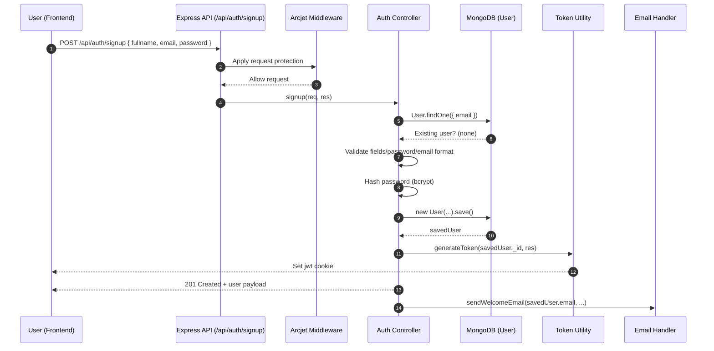
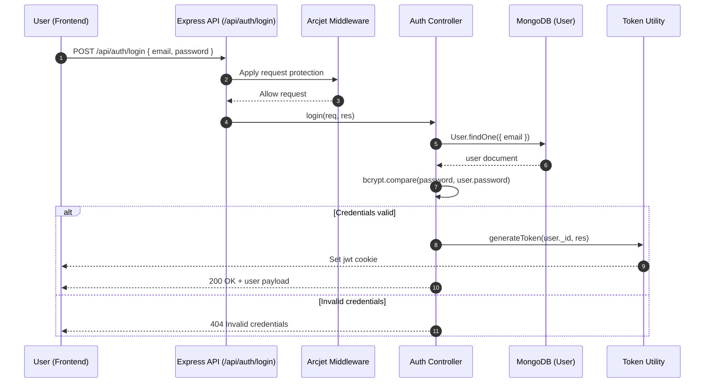
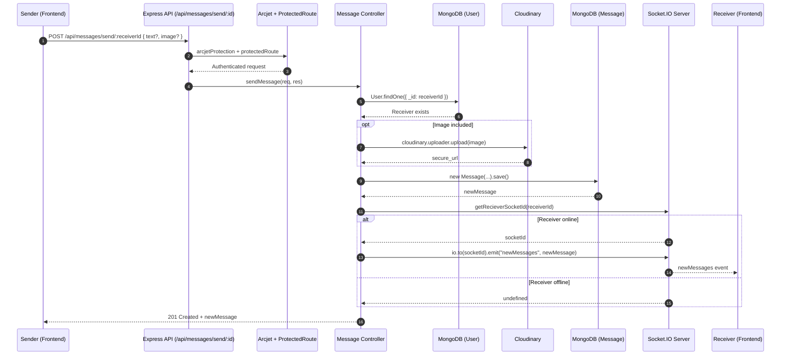
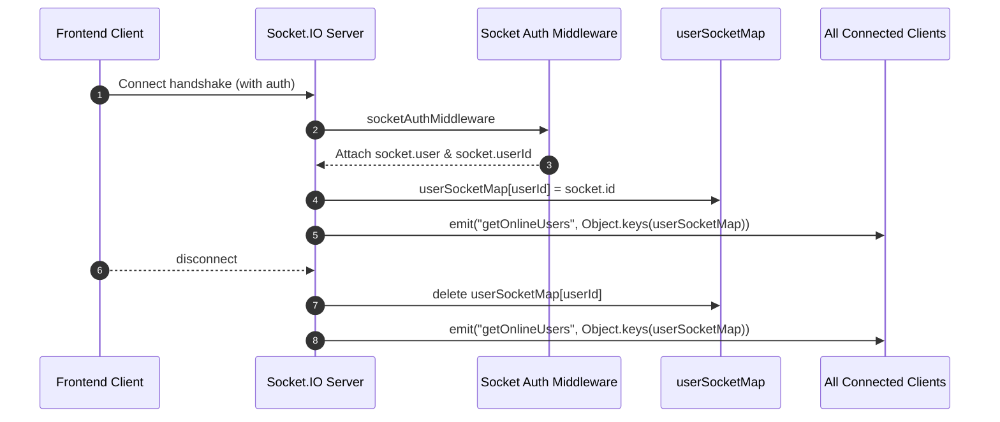

# Chatly Sequence Diagrams

The following diagrams describe the key backend and realtime interaction flows in this project.

## 1) User Signup

## 2) User Login

## 3) Send Message + Realtime Delivery

## 4) Socket Connection Lifecycle

